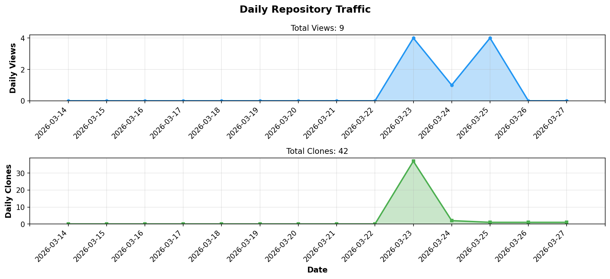
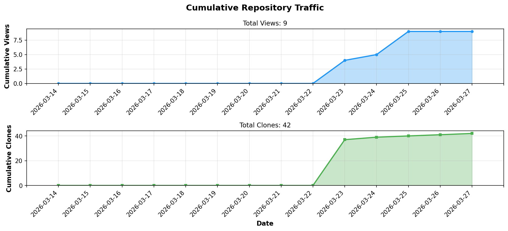

# Promps - Visual Prompt Builder

<div align="center">

**A Visual Block-Based Tool for Creating Structured AI Prompts**

**AIプロンプト作成のためのビジュアルブロックベースツール**

[](https://github.com/BonoJovi/Promps-Ent/releases)
[](https://github.com/BonoJovi/Promps-Ent)
[](https://www.rust-lang.org/)
[](https://tauri.app/)
[](LICENSE)

**Build prompts by dragging and dropping blocks, then send directly to AI!**

**Scratchのようにブロックでプロンプトを作成し、そのままAIに送信！**

</div>

---

## Message from Developer / 開発者からのメッセージ

<div style="border: 3px solid #4a90e2; padding: 20px; margin: 20px 0; background-color: #f8f9fa; font-size: 1.1em;">

### Prompsユーザの皆さんへ

いつもPrompsに関心を寄せていただき、誠にありがとうございます。
プロジェクト発案者のBonoJovi(Yoshihiro NAKAHARA)です。

**🎉 v3.0.0 をリリースいたしました！全機能が無料でご利用いただけます。**

**主な機能**:
- **ビジュアルブロック編集** - Scratchのようにドラッグ&ドロップでプロンプト作成
- **リアルタイム文法検証** - 6つのルールでブロック配置を即座にチェック
- **自動修正(AutoFix)** - ワンクリックでブロックを自動挿入
- **7種類のパターンテンプレート** - 日本語文型に沿ったスマート補完
- **プロジェクト保存/読込** - .promps形式で作業を保存・再開
- **Undo/Redo** - Ctrl+Z/Ctrl+Y でブロック操作を元に戻す・やり直し
- **APIキー管理** - OpenAI, Anthropic, Google AI のAPIキーを安全に管理
- **ダイレクトAI送信** - 生成したプロンプトをワンクリックでAIに送信
- **マルチAI比較** - 同じプロンプトを複数のAIに同時送信し、結果を並べて比較
- **QRコード＆LAN P2P共有** - QRコードやローカルネットワーク経由でプロンプトを共有
- **ウィザードテンプレート** - ガイド付きテンプレートでプロンプト作成をサポート

**[Announcement] フィードバックをお待ちしています！**
- [Issues](https://github.com/BonoJovi/Promps-Ent/issues) または [Discussions](https://github.com/BonoJovi/Promps-Ent/discussions) でご意見をお寄せください！

**2026-03-24 (JST) Written by Yoshihiro NAKAHARA**

---

### To Promps Users

Thank you for your continued interest in Promps.
I'm BonoJovi (Yoshihiro NAKAHARA), the project initiator.

**🎉 We have released v3.0.0! All features are now free to use.**

**Key Features**:
- **Visual block editing** - Create prompts by drag & drop, just like Scratch
- **Real-time grammar validation** - 6 rules to instantly check block placement
- **AutoFix** - One-click automatic block insertion
- **7 pattern templates** - Smart completion following Japanese sentence patterns
- **Project save/load** - Save and resume your work in .promps format
- **Undo/Redo** - Ctrl+Z/Ctrl+Y to undo/redo block operations
- **API Key Management** - Securely manage API keys for OpenAI, Anthropic, Google AI
- **Direct AI Send** - Send generated prompts to AI with one click, view responses instantly
- **Multi-AI Compare** - Send the same prompt to multiple AI providers and compare results
- **QR Code & LAN P2P Sharing** - Share prompts via QR codes or local network
- **Wizard Templates** - Guided templates to help create prompts

**[Announcement] We want to hear from you!**
- Share your ideas on [Issues](https://github.com/BonoJovi/Promps-Ent/issues) or [Discussions](https://github.com/BonoJovi/Promps-Ent/discussions)!

**2026-03-24 (JST) Written by Yoshihiro NAKAHARA**

</div>

<!-- STATS_START -->
## 📊 Repository Statistics

<div align="center">

### 📈 Daily Traffic



### 📊 Cumulative Traffic



| Metric | Count |
|--------|-------|
| 👁️ **Total Views** | **9** |
| 📦 **Total Clones** | **42** |

*Last Updated: 2026-03-29 01:34 UTC*

</div>
<!-- STATS_END -->

---

## Quick Start / クイックスタート

### 1. Download & Install / ダウンロード & インストール

**Available for: / 対応プラットフォーム：**
- Linux (AppImage, deb, rpm)
- Windows (exe installer, msi)
- macOS (dmg for Intel and Apple Silicon)

### 2. Build from Source / ソースからビルド

```bash
# Clone the repository / リポジトリをクローン
git clone https://github.com/BonoJovi/Promps-Ent.git
cd Promps-Ent

# Build the application / アプリケーションをビルド
cargo tauri build

# Or run in development mode / または開発モードで実行
cargo tauri dev
```

---

## How to Use / 使い方

### Step 1: Place Blocks / ステップ1: ブロックを配置

Drag blocks from the left panel to the workspace.
左パネルからワークスペースにブロックをドラッグします。

**Available block types: / 利用可能なブロックタイプ：**

- **Noun Block (名詞)**: For entities like "User", "Order", "Database"
  エンティティ用（「ユーザー」「注文」「データベース」など）

- **Particle Block (助詞)**: Japanese particles
  日本語の助詞（「が」「を」「に」「で」「と」「へ」「から」「まで」「より」）

- **Verb Block (動詞)**: 11 common verbs + custom input
  よく使う動詞11種（「分析して」「要約して」「翻訳して」「比較して」「調べて」「一覧にして」「説明して」「生成して」「評価して」「修正して」「変換して」）+ カスタム入力

- **Other Block (その他)**: For other words
  その他の単語用

### Step 2: Connect Blocks / ステップ2: ブロックを接続

- Snap blocks together to form sentences
  ブロックをスナップして文を形成します

- Blocks connect vertically to create sequences
  ブロックは縦方向に接続してシーケンスを作成します

### Step 3: Generate Prompt / ステップ3: プロンプトを生成

- Your prompt appears in real-time in the preview panel
  プレビューパネルにリアルタイムでプロンプトが表示されます

- Noun blocks are automatically marked with `(NOUN)` in the output
  名詞ブロックは出力で自動的に`(NOUN)`マークが付きます

- Copy the generated prompt for use with AI assistants
  生成されたプロンプトをコピーしてAIアシスタントで使用できます

---

## Example Usage / 使用例

### Building a Simple Prompt / シンプルなプロンプトの構築

**Blocks: / ブロック：**
```
[Noun: User] → [Particle: が] → [Noun: Order] → [Particle: を] → [Other: 作成]
```

**Generated Output: / 生成される出力：**
```
User (NOUN) が Order (NOUN) を 作成
```

### Using Verb Blocks / 動詞ブロックの使用

**Blocks: / ブロック：**
```
[Noun: Document] → [Particle: を] → [Verb: 分析して]
```

**Generated Output: / 生成される出力：**
```
Document (NOUN) を 分析して
```

### Building a Complex Prompt / 複雑なプロンプトの構築

**Blocks: / ブロック：**
```
[Noun: データベース] → [Particle: から] → [Noun: レコード] → [Particle: を]
→ [Other: 取得して] → [Noun: ファイル] → [Particle: に] → [Other: 保存]
```

**Generated Output: / 生成される出力：**
```
データベース (NOUN) から レコード (NOUN) を 取得して ファイル (NOUN) に 保存
```

---

## Features / 機能

### Core Features / コア機能

- ✅ Visual block-based interface (powered by Blockly.js)
  ビジュアルブロックベースのインターフェース（Blockly.js搭載）

- ✅ Project save/load (.promps format)
  プロジェクト保存/読込（.promps形式）

- ✅ Toolbar with keyboard shortcuts (Ctrl+N/O/S, Ctrl+Shift+S)
  キーボードショートカット付きツールバー

- ✅ 9 types of particle blocks (が、を、に、で、と、へ、から、まで、より)
  9種類の助詞ブロック

- ✅ Verb blocks (11 fixed + custom input)
  動詞ブロック（固定11種＋カスタム入力）

- ✅ Real-time prompt preview
  リアルタイムプロンプトプレビュー

- ✅ Automatic noun detection and marking
  自動名詞検出とマーキング

- ✅ Desktop application (Tauri + Rust)
  デスクトップアプリケーション（Tauri + Rust）

- ✅ Multi-platform support (Linux, Windows, macOS)
  マルチプラットフォーム対応

### Grammar Validation / 文法検証

- ✅ Real-time grammar validation with 6 rules
  6ルールによるリアルタイム文法検証

- ✅ AutoFix - one-click automatic block insertion
  自動修正 - ワンクリックでブロック自動挿入

- ✅ 7 Pattern templates (SOV, OV, Topic, Means, Parallel, Source-Dest, OSV)
  7種類のパターンテンプレート

- ✅ 9 Punctuation blocks (、。！？"'，/&)
  9種類の句読点ブロック

### AI Integration / AI統合

- ✅ **Undo/Redo**: Full undo/redo support (Ctrl+Z / Ctrl+Y)
  完全なアンドゥ/リドゥ対応

- ✅ **API Key Management**: Secure encrypted storage for AI provider API keys
  AI プロバイダーのAPIキーを暗号化して安全に保存
  - Supports: OpenAI, Anthropic, Google AI

- ✅ **Direct AI Send**: Send prompts directly to AI providers with one click
  ワンクリックでAIプロバイダーに直接プロンプトを送信
  - Supported models: GPT-4o-mini, Claude Sonnet 4, Gemini 2.5 Flash

- ✅ **Multi-AI Compare**: Send the same prompt to multiple AI providers and compare results
  同じプロンプトを複数のAIプロバイダーに送信して結果を比較

- ✅ **Tags & Search**: Organize projects with tags and search
  タグでプロジェクトを整理し、検索

- ✅ **Block Favorites & Floating Palette**: Quick access to frequently used blocks
  よく使うブロックへの素早いアクセス (Ctrl+B to toggle)

- ✅ **Template/Macro**: Save and reuse block groups
  ブロックグループの保存・再利用

- ✅ **Export**: Export prompts in .txt, .md, .json formats
  プロンプトを .txt/.md/.json 形式でエクスポート

- ✅ **Color Theme Customization**: Customize application color theme
  アプリケーションのカラーテーマをカスタマイズ

### Sharing / 共有

- ✅ **QR Code Sharing**: Generate and scan QR codes to share prompts instantly
  QRコードを生成・スキャンしてプロンプトを即座に共有

- ✅ **LAN P2P Transfer**: Direct peer-to-peer workspace transfer over local network
  ローカルネットワーク経由のダイレクトP2Pワークスペース転送

- ✅ **Wizard Templates**: Guided template-based prompt creation
  ガイド付きテンプレートベースのプロンプト作成

### Multilingual Support / 多言語対応

- ✅ **Japanese** (日本語) - Default
- ✅ **English** (英語)
- ✅ **French** (フランス語)
- ✅ Language-specific grammar validation and pattern templates
  言語別の文法検証とパターンテンプレート

---

## Network Requirements (v2.0.0+) / ネットワーク要件

The LAN P2P Sharing feature requires the following ports:
LAN P2P共有機能には以下のポートが必要です：

| Protocol | Port | Purpose / 用途 |
|----------|------|----------------|
| UDP | 5353 | mDNS peer discovery / mDNSピア検出 |
| TCP | 19750–19759 | P2P workspace transfer / P2Pワークスペース転送 |

**Firewall Configuration / ファイアウォール設定：**
- If LAN peers are not discovered, ensure UDP port 5353 and TCP ports 19750–19759 are allowed on your firewall.
  LANピアが検出されない場合、ファイアウォールでUDPポート5353とTCPポート19750〜19759を許可してください。
- QR Code sharing works without any port configuration (offline, camera-based).
  QRコード共有はポート設定不要です（オフライン、カメラベース）。

---

## Join Our Community / コミュニティに参加

**Help make Promps better for everyone!**
**Prompsをみんなのためにより良くするお手伝いをしてください！**

We welcome **all types of contributions** - not just code!
**あらゆる形の貢献**を歓迎します—コードだけではありません！

---

### Testers Wanted! / テスター募集！

**No programming experience needed! / プログラミング経験不要！**

**Platform Status: / プラットフォーム状況：**
- ✅ **Linux**: Verified and tested by developer / 開発者により検証済み・テスト済み
- ⚠ **Windows**: **Binary available but needs real hardware testing!** / **バイナリは利用可能だが実機テストが必要！**
- ⚠ **macOS (Intel & Apple Silicon)**: **Binary available but needs real hardware testing!** / **バイナリは利用可能だが実機テストが必要！**

**What we need from you: / お願いしたいこと：**
- Download and test the latest release / 最新リリースをダウンロード＆テスト
- Report any bugs or issues you encounter / 遭遇したバグや問題を報告
- Confirm if basic features work correctly / 基本機能が正常に動作するか確認
- Share your experience (UI/UX feedback welcome!) / 使用感を共有（UI/UXフィードバック歓迎！）
- Suggest new features or improvements / 新機能や改善点を提案

---

### Feature Requests & Feedback / 機能リクエスト & フィードバック

Have ideas to make Promps better?
Prompsをより良くするアイデアはありますか？

- **[Submit Feature Request](https://github.com/BonoJovi/Promps-Ent/issues/new)**
- **[Report a Bug](https://github.com/BonoJovi/Promps-Ent/issues/new)**
- **[Join Discussions](https://github.com/BonoJovi/Promps-Ent/discussions)** - Q&A, Ideas, General chat / 質問、アイデア、雑談

---

### Developers / 開発者

For code contributions:
コード貢献について：

- **[Contributing Guide](CONTRIBUTING.md)**
- **[Development Documentation](docs/)**

---

## Release History / リリース履歴

### v2.1.0 (2026-03-24) - Wizard Templates + Open Source

- ✨ **Wizard Templates**: Guided template-based prompt creation with custom wizard support
  **ウィザードテンプレート**: カスタムウィザード対応のガイド付きテンプレートプロンプト作成
- ✨ **Open Source**: All features are now free and open source (MIT License)
  **オープンソース化**: 全機能が無料かつオープンソース（MITライセンス）に

### v2.0.0 (2026-02-24) - QR Code & LAN P2P Sharing

- ✨ **QR Code Sharing**: Generate and scan QR codes to share prompts
- ✨ **LAN P2P Discovery**: Discover peers on local network via mDNS
- ✨ **LAN P2P Transfer**: Direct peer-to-peer workspace transfer

### v1.8.0 (2026-02-23) - French Language Support

- ✨ **French Language Support**: Added French as third language (ja → en → fr toggle)
- ✨ **French Grammar Validation**: SVO grammar rules with French token classification
- ✨ **French Pattern Templates**: 7 French prompt patterns

### v1.5.0 (2026-02-13) - Multi-AI Compare

- ✨ **Multi-AI Compare**: Send the same prompt to multiple AI providers and compare results

### v1.4.0 (2026-02-05) - Color Theme Customization

- ✨ **Color Theme Customization**: Light/Dark/Custom themes with per-element color settings

### v1.3.0 (2026-01-28) - Export Feature

- ✨ **Export Feature**: Export prompts and projects in .txt, .md, .json formats

### v1.0.0 (2026-01-26) - Stable Release

- 🎉 First stable release with all core features
- ✅ Grammar validation + AutoFix + Pattern templates
- ✅ Undo/Redo, API Key Management, Direct AI Send

### v0.0.6 (2026-01-26)

- ✨ Pattern Templates (7 patterns), Punctuation blocks (9 types), Advanced grammar rules, AutoFix

### v0.0.5 (2026-01-26)

- ✨ Grammar Validation Engine with 4 rules, Block highlighting, Validation UI

### v0.0.4 (2026-01-24)

- ✨ Project save/load (.promps format), Toolbar, Keyboard shortcuts

### v0.0.3 (2025-12-09)

- ✨ Verb blocks (11 fixed + custom input)

### v0.0.2 (2025-12-06)

- ✨ 9 particle blocks, Collapsible category UI

### v0.0.1 (2025-11-25)

- ✨ Initial release: Visual block builder with Blockly.js

---

## Technical Details / 技術詳細

**Tech Stack: / 技術スタック：**
- **Backend**: Rust (with Tauri v2 framework)
- **Frontend**: Vanilla HTML/CSS/JavaScript
- **Block Engine**: Blockly.js (Google's visual programming library)
- **Build System**: Cargo + Tauri CLI

**Tests: / テスト：**
- Backend: 255 tests (100% passing)
- Frontend: 625 tests (100% passing)
- **Total: 880 tests** (100% passing)

---

## License / ライセンス

**Promps** is open source software licensed under the [MIT License](LICENSE).
**Promps**は[MITライセンス](LICENSE)のオープンソースソフトウェアです。

Copyright (c) 2025-2026 Yoshihiro NAKAHARA

---

## Contact / 連絡先

- **Issues**: https://github.com/BonoJovi/Promps-Ent/issues
- **Email**: promps-dev@zundou.org

---

**Built with ❤ for better AI collaboration**
**より良いAIコラボレーションのために ❤ を込めて開発**
